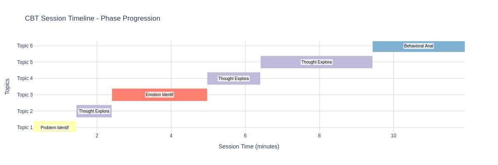

# CBT Therapy Session Analyzer

An AI-powered pipeline for analyzing Cognitive Behavioral Therapy (CBT) sessions, providing clinical insights, quality metrics, and actionable recommendations for mental health professionals.



## 🎯 Overview

This project demonstrates how Natural Language Processing (NLP) and machine learning can be applied to therapy session analysis while respecting privacy and clinical standards. The system processes audio recordings of therapy sessions to:

- Identify speakers (therapist vs. client)
- Transcribe conversations with high accuracy
- Classify CBT phases and therapeutic techniques
- Generate quality metrics and visualizations
- Provide actionable insights for therapists

## 🏗️ Architecture

```
Audio Input → Speaker Diarization → Transcription → CBT Analysis → Insights → Visualizations
```

### Key Components

1. **Speaker Diarization** - Separates therapist and client voices
2. **Transcription** - Converts speech to text with speaker labels
3. **CBT Phase Classification** - Identifies therapeutic structure
4. **Sentiment Analysis** - Tracks emotional trajectory
5. **Metrics Generation** - Calculates speaking ratios, technique usage
6. **Report Generation** - Creates visualizations and insights

## 🚀 Quick Start

### Prerequisites

- Python 3.11+
- FFmpeg (for audio processing)
- 8GB+ RAM recommended
- GPU optional but recommended for faster processing

### Installation

```bash
# Clone the repository
git clone https://github.com/solvire/fartemis.git
cd fartemis/therapy-analyzer

# Create virtual environment
python -m venv venv
source venv/bin/activate  # On Windows: venv\Scripts\activate

# Install dependencies
pip install -r requirements.txt
```

### Required API Keys

1. **HuggingFace** (for pyannote.audio):
   - Create account at https://huggingface.co
   - Generate token at https://huggingface.co/settings/tokens
   - Accept pyannote model terms

2. **AssemblyAI** (for transcription):
   - Sign up at https://www.assemblyai.com
   - Get free API key (5 hours/month free tier)

### Environment Setup

```bash
# Create .env file
echo "HUGGINGFACE_TOKEN=your_token_here" > .env
echo "ASSEMBLYAI_API_KEY=your_key_here" >> .env
```

## 📊 Usage

### Complete Pipeline

```bash
# Run all steps sequentially
python run_analysis.py --audio path/to/therapy_session.wav
```

### Individual Steps

```bash
# 1. Download audio (if from YouTube)
python 01_download_audio.py --url "https://youtube.com/watch?v=..."

# 2. Speaker diarization (identify speakers)
python 02_speaker_diarization.py --input therapy_session.wav

# 3. Transcribe with AssemblyAI
python 03_transcribe_audio.py

# 4. Analyze CBT structure
python 04_segment_classifier.py

# 5. Generate visualizations
python 05_generate_visualizations.py
```

## 📁 Project Structure

```
therapy-analyzer/
├── scripts/
│   ├── 01_download_audio.py      # YouTube audio downloader
│   ├── 02_speaker_diarization.py # Speaker identification
│   ├── 03_transcribe_audio.py    # Speech-to-text
│   ├── 04_segment_classifier.py  # CBT phase detection
│   └── 05_generate_visualizations.py # Create charts
├── data/
│   ├── audio/                    # Input audio files
│   ├── transcripts/              # Transcription results
│   ├── analysis/                 # CBT analysis output
│   └── reports/                  # Generated visualizations
├── requirements.txt              # Python dependencies
├── README.md                     # This file
└── .env.example                  # Environment variables template
```

## 🔧 Technical Details

### CBT Phase Classification

The system identifies 8 key CBT phases:

```python
cbt_phases = {
    "rapport_building": "Establishing therapeutic alliance",
    "problem_identification": "Identifying specific issues",
    "thought_exploration": "Exploring thought patterns",
    "emotion_identification": "Recognizing emotions",
    "behavioral_analysis": "Examining behaviors",
    "cognitive_restructuring": "Challenging thoughts",
    "homework_planning": "Setting goals",
    "session_closure": "Wrapping up"
}
```

### Therapeutic Techniques Detected

- Socratic questioning
- Validation statements
- Reframing
- Psychoeducation
- Homework assignments
- Summarizing
- Empathy statements

### Output Metrics

- **Speaking Ratio**: Time balance between therapist and client
- **Question Ratio**: Percentage of therapist utterances as questions
- **Average Response Length**: Words per utterance
- **Sentiment Trajectory**: Emotional changes throughout session
- **Phase Distribution**: Time spent in each CBT phase

## 📈 Example Results

From our sample analysis:
- **Speaking ratio**: Therapist 31.5%, Client 68.5% (ideal balance)
- **Socratic questioning**: 60% of therapist utterances
- **Session structure**: 6 distinct CBT phases covered
- **Emotional trajectory**: Progressive improvement in client sentiment

## ⚙️ Configuration

### Adjusting Analysis Parameters

Edit `config.yaml`:

```yaml
analysis:
  min_speaker_duration: 2.0  # Minimum seconds for speaker turn
  sentiment_window: 30       # Seconds for sentiment smoothing
  
transcription:
  language: "en"
  speakers_expected: 2
  
visualization:
  color_scheme: "clinical"   # or "colorful"
  output_format: "png"       # or "html", "svg"
```

## 🔒 Privacy & Ethics

- **No data storage**: Audio files are processed locally and not uploaded anywhere
- **De-identification**: No personal information is extracted or stored
- **Clinical oversight**: This tool assists but doesn't replace clinical judgment
- **Consent required**: Only analyze sessions with proper consent

## 🐛 Troubleshooting

### Common Issues

1. **Slow diarization** (7+ hours on CPU):
   ```bash
   # Use GPU acceleration
   pip install torch torchvision torchaudio --index-url https://download.pytorch.org/whl/cu118
   ```

2. **AssemblyAI rate limits**:
   - Free tier: 5 hours/month
   - Upgrade at https://www.assemblyai.com/pricing

3. **Memory errors**:
   - Process shorter segments
   - Reduce model size in config

### Debug Mode

```bash
# Run with verbose logging
python run_analysis.py --audio session.wav --debug
```

## 📚 References

- Beck, A. T. (1979). *Cognitive therapy and the emotional disorders*
- [pyannote.audio](https://github.com/pyannote/pyannote-audio) - Speaker diarization
- [AssemblyAI](https://www.assemblyai.com/docs) - Speech recognition API
- [Plotly](https://plotly.com/python/) - Interactive visualizations

## 🤝 Contributing

We welcome contributions! Please see [CONTRIBUTING.md](CONTRIBUTING.md) for guidelines.

### Areas for Improvement

- [ ] Real-time processing capabilities
- [ ] Support for other therapy modalities (DBT, ACT)
- [ ] Multi-language support
- [ ] Integration with EHR systems
- [ ] Enhanced privacy features

## 📝 License

This project is licensed under the MIT License - see [LICENSE](LICENSE) file for details.

## 🙏 Acknowledgments

- Sample therapy session from [YouTube video title]
- CBT structure based on Beck Institute guidelines
- Built as part of the Fartemis project

## 📧 Contact

- **Author**: Steven Scott
- **Email**: stevenjscott@gmail.com
- **LinkedIn**: [/in/iamstevenscott](https://linkedin.com/in/iamstevenscott)
- **Project**: Part of [Fartemis](https://github.com/solvire/fartemis)

---

*Built with ❤️ for mental health professionals*